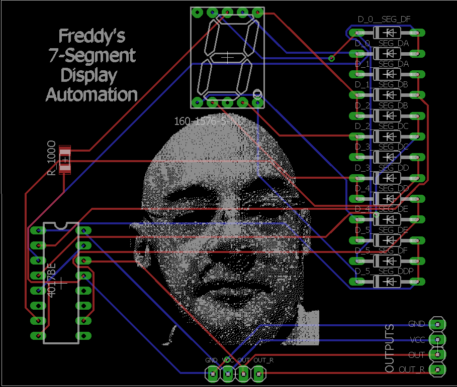

# Freddy's 7-Segment Display Animation

How to create an animation using a [CD4017BE](http://www.ti.com/lit/ds/symlink/cd4017b.pdf) a decade counter and a lot of diodes.

* [Video](https://www.youtube.com/watch?v=Pmq1hEMuzKk)

* [Photos](https://www.flickr.com/photos/138302041@N06/albums/72157710833673621)

![schema(./4017-7Segment.schema.png)
